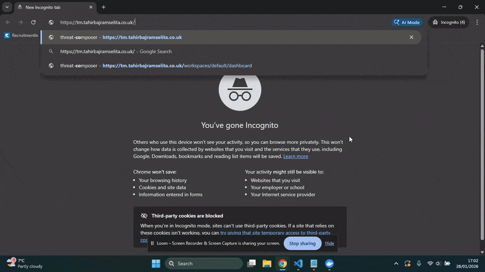
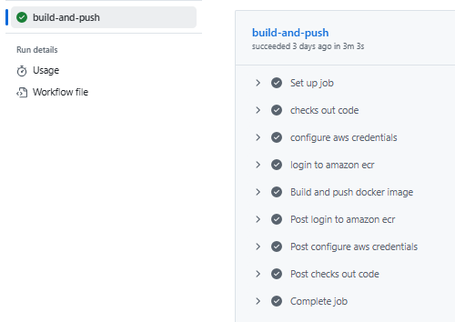
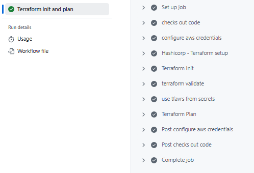
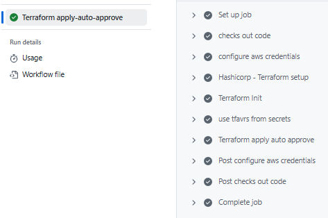
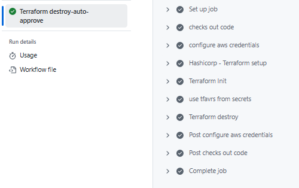

<div align="center">
  
  <h1 style="font-size: 3.5em;">AWS Threat Composer Deployed on ECS Fargate</h1>
<p>
    <a href="#"></a>
    <a href="#"></a>
    <a href="#"></a>
    <a href="#"></a>
  </p>
</div>

---

## Introduction
This project exhibits the deployment of AWS Threat Composer to ECS Fargate using modern DevOps practices. I've used Docker for efficient containerisation, GitHub Actions for automated CI/CD pipelines, and Terraform for defining and managing all necessary AWS infrastructure including ECS, Fargate, ALB, and Route 53. The goal is to create a highly available web service accessible via my custom domain.

## Architecture diagram

<div align="center">
  
  </div>

## Project Structure

```
├── .github/
│   └── workflows/
│       ├── apply.yml
│       ├── destroy.yml
│       ├── docker_build_push.yml
│       └── init_and_plan.yml
├── App/
│   ├── dockerfile
│   └──.dockerignore
├── images/
├── terraform/
│   ├── modules/
│   │   ├── ACM/
│   │   │   ├── main.tf
│   │   │   ├── outputs.tf
│   │   │   └── variables.tf
│   │   ├── ALB/
│   │   │   ├── main.tf
│   │   │   ├── outputs.tf
│   │   │   └── variables.tf
│   │   ├── Backend/
│   │   │   ├── main.tf
│   │   │   ├── outputs.tf
│   │   │   └── variables.tf
│   │   ├── ECS/
│   │   │   ├── main.tf
│   │   │   ├── outputs.tf
│   │   │   └── variables.tf
│   │   ├── Route 53/
│   │   │  ├── main.tf
│   │   │  ├── outputs.tf
│   │   │  └── variables.tf
│   │   └── VPC/
│   │       ├── main.tf
│   │       ├── outputs.tf
│   │       └── variables.tf
│   ├── main.tf
│   ├── outputs.tf
│   ├── providers.tf
│   ├── terraform.tfvars
│   └── variables.tf
├── .gitignore
└── README.md
```

---

## Final Product and SSL/TLS certificate - tm.tahirbajramselita.co.uk

<div align="center">
  
  </div>

  <div align="center">
  
  </div>


---

## Key Features
### 1. Docker Image Build
Multi-stage build separates the Node.js build environment from production runtime, reducing image size and deployment times. The application runs as a non-root user (devone) for enhanced security and reduced attack surface.
### 2. AWS Infrastructure (Terraform)
All AWS resources are deployed using Terraform, ensuring Infrastructure as Code (IaC) and DRY principles are followed. Resources are organised into modular components for maintainability and reusability. The setup includes:
- VPC with public and private subnets deployed across two availability zones for high availability and fault tolerance
- Application Load Balancer (ALB) to distribute incoming traffic
- Security Groups to control access
- DNS records managed via Route 53
- AWS Certificate Manager (ACM) providing SSL/TLS certificates for HTTPS encryption
- NAT Gateways enabling private ECS tasks to reach external services with controlled outbound connectivity
  
### 3. Container Orchestration (ECS on Fargate)
The app runs on AWS Fargate with ECS managing task lifecycle and deployments whilst task definitions and IAM roles configure the container runtime and grant access to CloudWatch logging and ECR image retrieval.

### 4. Domain Management (Route 53 & ACM)
Route 53 takes your custom domain name (tm.tahirbajramselita.co.uk) and points it to your load balancer, so visitors can type a readable web address instead of the load balancer's URL, whilst ACM provides an SSL certificate ensuring security.

### 5. CI/CD Workflow 
### Continuous Integration (CI) - Docker Image
 - Checkout code
 - Configure AWS credentials using OIDC and login to AWS ECR
 - Build, tag and push Docker image to ECR with main tag

<div align="left">
  
  </div>
  
### Continuous Integration (CI) - Terraform Plan
- Checkout code
- Configure AWS credentials using OIDC
= Initialise Terraform and validate configuration
- Generate Terraform plan to preview infrastructure changes

<div align="left">
  
  </div>
  
### Continuous Delivery (CD) - Terraform Apply
- Checkout code
- Configure AWS credentials using OIDC
- Apply Terraform changes (terraform apply -auto-approve) to deploy/update AWS infrastructure

<div align="left">
  
  </div>
  
### Continuous Delivery (CD) - Terraform Destroy
- Checkout code.
- Configure AWS credentials using OIDC.
- Destroy infrastructure (terraform destroy -auto-approve) to tear down all AWS resources.

<div align="left">
  
  </div>
  
### Key Security Feature: OIDC Authentication
All workflows use GitHub's OIDC token exchange to assume AWS roles, eliminating the need for long lived API credentials stored as secrets.
